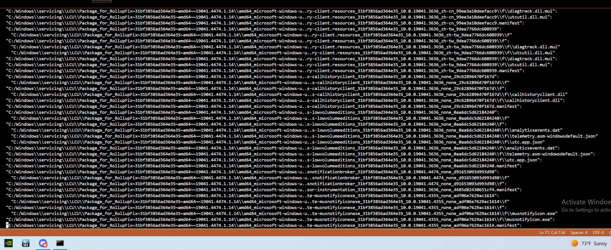
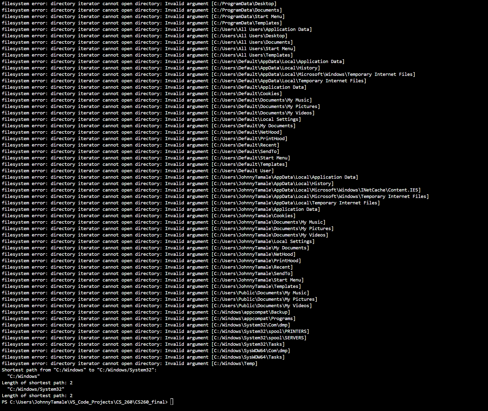

# CS260_final

Design: Use the graph to represent a file system, where each vertex is a file or a directory, and each edge represents a "contains" relationship. Use the addVertex function to add a new file or directory, the addEdge function to represent a "contains" relationship, the shortestPath function to find the shortest path between two files or directories, and the minSpanTree function to find a minimum spanning tree of the file system.

Tests: Create tests for each function. For addVertex and addEdge, we can check if the number of vertices and edges increases after calling the function. For shortestPath, we can check if the returned path is indeed the shortest. For minSpanTree, we can check if the returned tree is indeed a minimum spanning tree.

Implementation:  Implement the Graph class with the addVertex, addEdge, shortestPath, and minSpanTree functions. The addVertex function will add a new vertex to the adjacency matrix. The addEdge function will add a new edge to the adjacency matrix. The shortestPath function will use Dijkstra's algorithm to find the shortest path between two vertices. The minSpanTree function will use Prim's algorithm to find a minimum spanning tree of the graph.

Complexity Analysis: The complexity of addVertex and addEdge is O(V^2), where V is the number of vertices. The complexity of shortestPath and minSpanTree is O(V^2), but it can be improved to O(E + V log V) with a priority queue, where E is the number of edges.

# First version screenshot
This was amazing to watch. It took about 3 minutes to go through all the directories in the graph

# Shortest Path Test 1 Output

